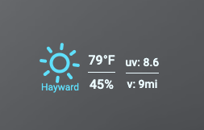

# 🔥 Flame: Smart Start Page with GeoIP Weather

**Flame** is a self-hosted homepage for your homelab or server — now enhanced with:

- 🌦 Weather based on **client IP geolocation** (automatic) with a cached lookup system
- 💾 Fallback to custom coordinates from `config.json` as configured in GUI settings
- 🔁 Caching logic to reduce WeatherAPI requests
- 🗄️ External logging, including reverse proxy logic for IPs, for integration to Vector > mtail > Prometheus > Grafana
- 🎨 Custom browser favicon.ico
- 🐳 Docker-first deployment using the included Dockerfile
- 🏥 Advanced health check route with debug 

---

## 📦 Features

- Bookmark & application launcher
- IP geolocation-based weather with caching
- Light & dark themes
- Customize favicon.ico
- Mobile-responsive design
- No database required — JSON file-backed
- Secure auth with optional login
- Traefik-friendly and ready for reverse proxy setups
- More weather data for those who want it

---

## 🚀 Quick Start (Docker)

```yaml
version: "3.8"

services:
  flame:
    build:
      context: https://github.com/spiicytuna/flame.git#feature/geoip-weather-adv-logging-and-builtin-healthcheck:.docker
      dockerfile: Dockerfile
    container_name: flame
    restart: unless-stopped
    ports:
      - "5005:5005"
    volumes:
      - /path/to/data:/app/data
      - /path/to/ext/log:/app/log
      - /path/to/favicon.ico:/app/public/icons/favicon.ico
    environment:
      - PASSWORD=changeme
      - WEATHER_CACHE_HOURS=6
```

## 🌎 IP-Based Weather

- Uses public services like `ip-api.com` and `ipinfo.io` to determine client geolocation.
- The location shows below the weather  icon since weather is dynamic based on GeoIP.
- Falls back to static coordinates defined in `config.json` (from Flame settings) if IP lookup fails.
- Weather is retrieved from [WeatherAPI.com](https://www.weatherapi.com/), using your API key.
- Supports IP-based switching (e.g. VPN users will see weather for new IP automatically).
- Want Flame to be like the original with specific lat/lon; support for this as well

### 🔁 Caching Logic

- Weather is cached per `lat,lon` pair for a configurable duration via `WEATHER_CACHE_HOURS` (defaults to 3).
- Cached weather is served on all subsequent connections from the same IP/location.
- If the IP address changes, weather is re-fetched immediately and cached separately.
- Logs show whether the request was served from cache or fetched fresh along with the requesting IP address 

```log
[Weather] Fetching fresh data from WeatherAPI for key 35.6403,-102.0667
[Weather] Serving from cache for key 35.6403,-102.0667
```

## 🎨 Custom Favicon

To use your own favicon:

1. Save your `favicon.ico` in any local directory (e.g. `./branding/favicon.ico`)
2. Add this volume to your `docker-compose.yaml`:

   ```yaml
   volumes:
     - ./branding/favicon.ico:/app/public/icons/favicon.ico
   ```

3. Rebuild or restart the container

Your favicon will now show up in the browser tab!


## 🌦️ Optional Third Weather Column


Flame now supports an **additional weather data column**, configurable in the UI under **Settings > Weather > Extra Data**.

### Enable via UI:

- ✅ Toggle: "Show third weather column?"
- ✅ Dropdown: "Top data"
- ✅ Dropdown: "Bottom data"

Options include:

| Label              | API Field     | Example Output |
|-------------------|---------------|----------------|
| Precipitation MM  | `precip_mm`   | `p: 2.3mm`     |
| Precipitation IN  | `precip_in`   | `p: 0.09in`    |
| Visibility KM     | `vis_km`      | `v: 6.0km`     |
| Visibility MILES  | `vis_miles`   | `v: 3.7mi`     |
| UV Index          | `uv`          | `uv: 5`        |
| Wind KPH          | `gust_kph`    | `w: 22kph`     |
| Wind MPH          | `gust_mph`    | `w: 13mph`     |

Column appears in the weather widget if enabled.


## ✅ Built-in Healthcheck

Flame includes an internal `/health` route that returns a status report of key system functions.

### Basic Usage

```bash
curl http://localhost:5005/health
```

Returns a simple JSON result:

```json
{ "status": "healthy", "errors": [] }
```


### Debug Mode

For deeper insight into failures, enable debug mode:

```bash
curl http://localhost:5005/health?debug=true
```

This adds:

- The list of recent error messages (from `access.log`)
- Health status set to `"unhealthy"` if 5+ recent error lines exist

Returns nicely formatted JSON result:
```bash
curl -s http://localhost:5005/health?debug=true | jq -r '.status, .errors[], .recentErrorLines[]'
```

For testing purposes:
```bash
# send simulated errors to the log (from inside the container)
echo "[2025-07-15 00:00:00 UTC+0] [ERROR] Simulated error for testing" >> /var/log/flame-dash/access.log

# cleanup simulated errors (from inside the container)
sed -i '/Simulated error for testing/d' /app/log/access.log
```


### What is Checked

The healthcheck validates:

- ✅ `config.json` exists and is readable
- ✅ SQLite database exists and is connectable
- ✅ Weather logging directory `/app/log/` and file `access.log` exist
- ✅ If in GeoIP mode, checks `geo-cache.json` exists and most recent IP has coordinates
- ✅ Less than 5 errors in logs in the last 12 hours
- ✅ Verify port 5005 is open and ready for connections (indirectly, healthcheck is served at port 5005)


---


## 🧱 Mounting /app/log for Logging

To enable external log parsing, mount the log directory to your host:

```yaml
volumes:
  - /var/data/flame:/app/data
  - /var/log/flame-dash:/app/log
```

Ensure the log folder is writable by the container user:

```bash
sudo mkdir -p /var/log/flame-dash
sudo chown 1000:1000 /var/log/flame-dash
sudo chmod 775 /var/log/flame-dash
```

---

## 🐳 Recommended Docker Healthcheck

Add this to your `docker-compose.yaml` to enable automatic container health monitoring:

```yaml
healthcheck:
  test: ["CMD", "curl", "-sf", "http://localhost:5005/health"]
  interval: 10m
  timeout: 10s
  retries: 3
```

With `curl` and `jq` installed in the container, you may also use:

```yaml
test: ["CMD", "sh", "-c", "curl -sf http://localhost:5005/health?debug=true | jq -e '.status == "healthy"'"]
```

Make sure your Dockerfile includes:

```dockerfile
RUN apk add --no-cache curl jq
```

---

## 🧠 How It Works

- On client connection, Flame reads the external IP and resolves coordinates.
- The backend sends the weather data via WebSocket (`/socket`) to the frontend.
- This enables real-time updates on page load — no reload required.
- If the client’s coordinates differ from what’s in the SQLite DB (or cache TTL expired), it fetches new data.
- Configurable for set lat/lon if that is your preference

### 🗃 Where Data Is Stored

| File                    | Purpose                                 |
|-------------------------|-----------------------------------------|
| `data/config.json`      | Static lat/lon fallback, units, etc.    |
| `data/geo-cache.json`   | IP → lat/lon cache                      |
| `data/access.log`      | Weather fetch & WebSocket logs (if enabled) |

---

## 🔧 Optional Environment Variables

| Variable              | Description                                              | Default     |
|-----------------------|----------------------------------------------------------|-------------|
| `WEATHER_CACHE_HOURS` | Max time to cache weather data per unique IP location    | `3`         |
| `PASSWORD`            | Initial login password                                   | _none_      |
| `PORT`                | HTTP port Flame listens on                               | `5005`      |
| `NODE_ENV`            | Set to `production` or `development`                     | `production`|

_Important_: If `WEATHER_CACHE_HOURS` is set above 23, it is clamped to 23 and logged.

---

## 📁 Data Volume Structure

Make sure to persist `/app/data` in your Docker container.

```plaintext
/app/data/
├── apps.json            # Application entries
├── bookmarks.json       # Bookmarks and categories
├── categories.json      # Bookmark categories
├── config.json          # Settings (API key, units, etc.)
├── geo-cache.json       # IP-to-location cache
├── users.json           # Login credentials
└── access.log          # Optional debug/weather logging
```

---

## 🛠 Manual Build (Optional)

To build from your fork:

```bash
git clone https://github.com/spiicytuna/flame.git
cd flame
docker build -f .docker/Dockerfile -t flame-custom .
```

Then run with:

```bash
docker run -p 5005:5005 -v /your/data:/app/data flame-custom
```

## 📄 License

MIT License
