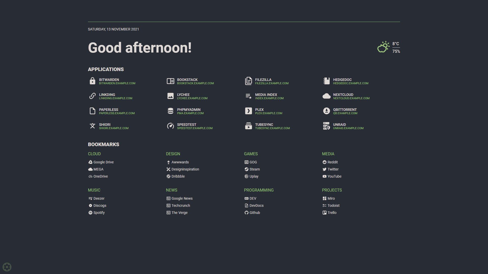
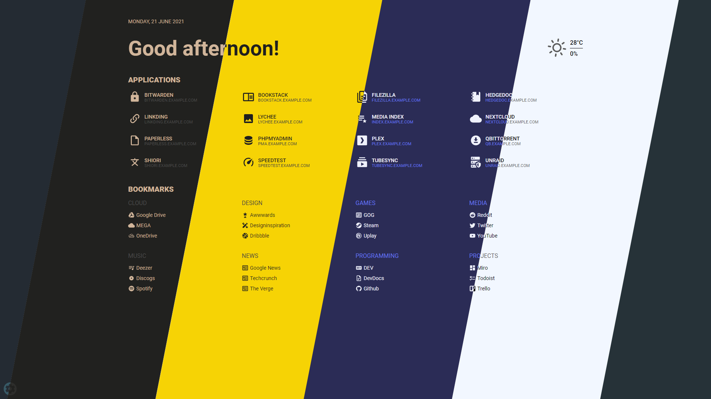

# Flame



## Description

Flame is self-hosted startpage for your server. This is a direct fork from [pawelmalak](https://github.com/pawelmalak/flame) with [secutity updates](https://github.com/spiicytuna/flame/commit/a8559b4e509e00e33f3947b5e9495c4e90759e6f) applied and built-in [healthcheck](https://github.com/spiicytuna/flame/commit/a02bf19f39a58c266825f0727e5ef21a7f953451) path (oh and not important but fun, heh, [updated mdi icons](https://github.com/spiicytuna/flame/commit/c9f11816d9c84379fac16dd589d178fae6cb81e4)). 

Flame is very easy to setup and use. With built-in editors, it allows you to setup your very own application hub in no time - no file editing necessary.

## Functionality
- 📝 Create, update, delete your applications and bookmarks directly from the app using built-in GUI editors
- 📌 Pin your favourite items to the homescreen for quick and easy access
- 🔍 Integrated search bar with local filtering, 11 web search providers and ability to add your own
- 🔑 Authentication system to protect your settings, apps and bookmarks
- 🔨 Dozens of options to customize Flame interface to your needs, including support for custom CSS, 15 built-in color themes and custom theme builder
- ☀️ Weather widget with current temperature, cloud coverage and animated weather status
- 🐳 Docker integration to automatically pick and add apps based on their labels

## Installation

### With Docker (recommended)


```sh
# built with multiarch support
docker pull ghcr.io/spiicytuna/flame:stable

```

#### Deployment

```sh
# run container
docker run -p 5005:5005 -v /path/to/data:/app/data -e PASSWORD=flame_password spiicytuna/flame
```

#### Building images

```sh
git clone https://github.com/spiicytuna/flame

cd flame

git checkout master

# build multiarch image for amd64, armv7 and arm64
# building failed multiple times with 2GB memory usage limit so you might want to increase it
docker buildx build \
  --platform linux/arm/v7,linux/arm64,linux/amd64 \
  -f .docker/Dockerfile.multiarch \
  -t ghcr.io/spiicytuna/flame:master \
  . 
```

#### Docker-Compose

```yaml
version: "3.8"

services:
  flame:
    image: ghcr.io/spiicytuna/flame:dev
    container_name: flame
    restart: unless-stopped
    ports:
      - "5005:5005"
    volumes:
      - /path/to/data:/app/data
      # - /path/to/favicon.ico:/app/public/icons/favicon.ico  #  optional change to your own favicon.co
      # - /var/log/flame-dash:/app/log  #  optional external access.log remote logging or fail2ban
      # - /var/run/docker.sock:/var/run/docker.sock # optional but required for Docker integration
    environment:
      - PASSWORD=changeme
      # - WEATHER_CACHE_HOURS=6  #  optional to cut down calls to weather api
    healthcheck:
      test: ["CMD", "curl", "-fs", "http://localhost:5005/health"]
      interval: 60s
      timeout: 10s
      retries: 3
```

##### Docker Secrets

All environment variables can be overwritten by appending `_FILE` to the variable value. For example, you can use `PASSWORD_FILE` to pass through a docker secret instead of `PASSWORD`. If both `PASSWORD` and `PASSWORD_FILE` are set, the docker secret will take precedent.

```bash
# ./secrets/flame_password
my_custom_secret_password_123

# ./docker-compose.yml
secrets:
  password:
    file: ./secrets/flame_password
```

#### Skaffold

```sh
# use skaffold
skaffold dev
```

## Development

### Technology

- Backend
  - Node.js + Express
  - Sequelize ORM + SQLite
- Frontend
  - React
  - Redux
  - TypeScript
- Deployment
  - Docker
  - Kubernetes

### Creating dev environment

```sh
# clone repository
git clone https://github.com/spiicytuna/flame
cd flame

# run only once
npm run dev-init

# start backend and frontend development servers
npm run dev
```

## Screenshots




## Usage


### Search bar

#### Searching

The default search setting is to search through all your apps and bookmarks. If you want to search using specific search engine, you need to type your search query with selected prefix. For example, to search for "what is docker" using google search you would type: `/g what is docker`.

For list of supported search engines, shortcuts and more about searching functionality visit the original [project wiki](https://github.com/pawelmalak/flame/wiki/Search-bar) (pawelmalak).

### Setting up weather module

1. Obtain API Key from [Weather API](https://www.weatherapi.com/pricing.aspx).
   > Free plan allows for 1M calls per month. Flame is making less then 3K API calls per month.
2. Get lat/long for your location. You can get them from [latlong.net](https://www.latlong.net/convert-address-to-lat-long.html).
3. Enter and save data. Weather widget will now update and should be visible on Home page.

### Docker integration

In order to use the Docker integration, each container must have the following labels:

```yml
labels:
  - flame.type=application # "app" works too
  - flame.name=My container
  - flame.url=https://example.com
  - flame.icon=icon-name # optional, default is "docker"
# - flame.icon=custom to make changes in app. ie: custom icon upload
```

> "Use Docker API" option must be enabled for this to work. You can find it in Settings > Docker

You can also set up different apps in the same label adding `;` between each one.

```yml
labels:
  - flame.type=application
  - flame.name=First App;Second App
  - flame.url=https://example1.com;https://example2.com
  - flame.icon=icon-name1;icon-name2
```

If you want to use a remote docker host follow this instructions in the host:

- Open the file `/lib/systemd/system/docker.service`, search for `ExecStart` and edit the value

```text
ExecStart=/usr/bin/dockerd -H tcp://0.0.0.0:${PORT} -H unix:///var/run/docker.sock
```

>The above command will bind the docker engine server to the Unix socket as well as TCP port of your choice. “0.0.0.0” means docker-engine accepts connections from all IP addresses.

- Restart the daemon and Docker service

```shell
sudo systemctl daemon-reload
sudo service docker restart
```

- Test if it is working

```shell
curl http://${IP}:${PORT}/version
```

### Kubernetes integration

In order to use the Kubernetes integration, each ingress must have the following annotations:

```yml
metadata:
  annotations:
  - flame.spiicytuna/type=application # "app" works too
  - flame.spiicytuna/name=My container
  - flame.spiicytuna/url=https://example.com
  - flame.spiicytuna/icon=icon-name # optional, default is "kubernetes"
```

> "Use Kubernetes Ingress API" option must be enabled for this to work. You can find it in Settings > Docker

### Import HTML Bookmarks (Experimental)

- Requirements
  - python3
  - pip packages: Pillow, beautifulsoup4
- Backup your `db.sqlite` before running script!
- Known Issues:
  - generated icons are sometimes incorrect

```bash
pip3 install Pillow, beautifulsoup4

cd flame/.dev
python3 bookmarks_importer.py --bookmarks <path to bookmarks.html> --data <path to flame data folder>
```

### Custom CSS and themes

See the original project wiki (pawelmalak) for [Custom CSS](https://github.com/pawelmalak/flame/wiki/Custom-CSS) and [Custom theme with CSS](https://github.com/pawelmalak/flame/wiki/Custom-theme-with-CSS).
